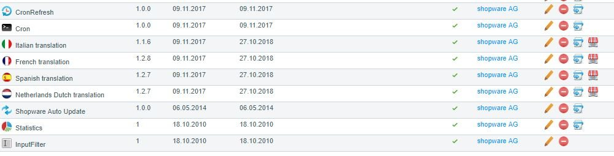
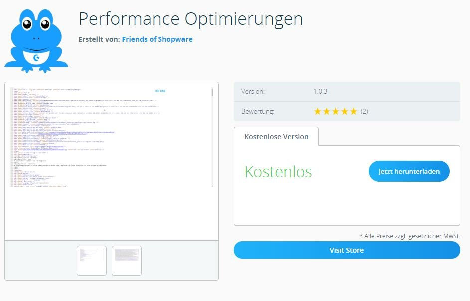

# FroshExtendedPluginManager

## Description

Displays buttons to visit plugin in shopware-store

### Features

### Planned Features

- ...idea?

## Zip-Installation

* Download the [latest plugin version](https://github.com/FriendsOfShopware/FroshExtendedPluginManager/releases/latest/)
* Upload and install plugin using Plugin Manager

## Contributing

Feel free to fork and send [pull requests](https://github.com/FriendsOfShopware/FroshExtendedPluginManager)!

## Licence

This project uses the [MIT License](LICENCE.md).
